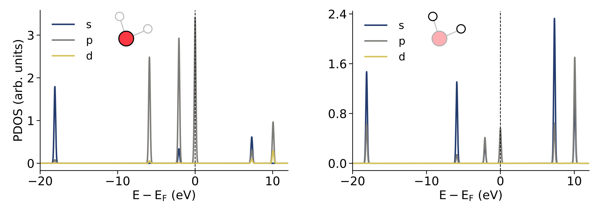
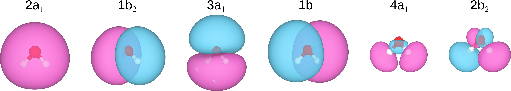
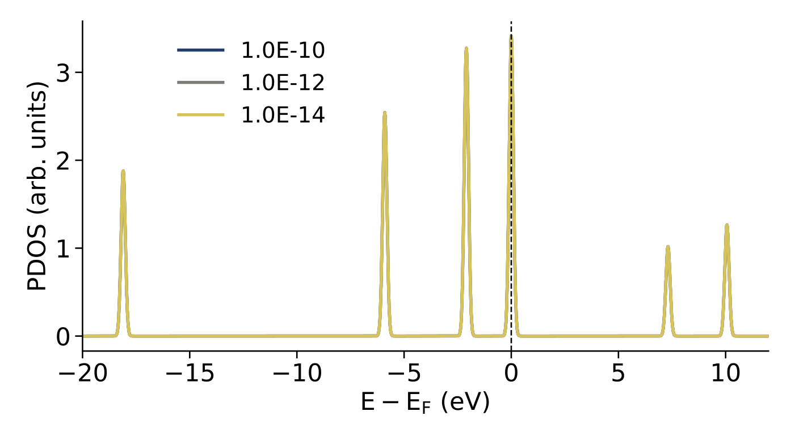

# Results - Single water molecule

This section presents the **projected density of states (PDOS)** for a **single water molecule in an empty (non-periodic) simulation box**, computed via a geometry optimization using CP2K. The computational parameters used for these calculations are those described in **README.md** and **input.inp**, and define the reference setup for the first set of results shown below.

In the following sections, several key parameters are systematically varied, namely `BASIS_SET`, `CUTOFF`, `EPS_SCF`, and `XC_FUNCTIONAL`, in order to assess their respective impact on the computed PDOS.

## PDOS of a single water molecule

Figure 1 shows the computed **projected density of states (PDOS)** of an isolated H₂O molecule, decomposed into contributions from **oxygen (O)** and **hydrogen (H)** atoms. Energies are referenced to the Fermi level, which in CP2K is defined as the energy of the **highest occupied molecular orbital (HOMO)** for finite, non-periodic systems.

The labels used to denote the different molecular orbitals (MOs), e.g. 2a₁, 1b₂, 3a₁, originate from **group-theory**. Specifically, they correspond to the **irreducible representations of the C₂v group**, which is the symmetry group of the H₂O molecule in its equilibrium geometry. The letters (a₁, b₁, b₂) indicate the symmetry of the molecular orbitals with respect to the symmetry operations of the C₂v group, while the leading number labels orbitals of the same symmetry in order of increasing energy.

  

  Figure 1 — PDOS (projected per atom-type) of an isolated H₂O molecule.

Among the **occupied states** at negative energies, the deep-lying **2a₁** orbital exhibits a mixed contribution from both oxygen and hydrogen atoms, reflecting its bonding character involving O–H interactions. The valence orbitals **1b₂** and **3a₁** are dominated by oxygen character with a smaller hydrogen contribution, consistent with O–H bonding and hybridization. The **highest occupied molecular orbital (HOMO)**, labeled **1b₁**, is almost entirely oxygen-centered, in agreement with its largely non-bonding O 2p character.

At positive energies, the **unoccupied molecular orbitals** (**4a₁**, **2b₂**) become visible and exhibit increased hydrogen character, reflecting their antibonding nature. At higher energies, additional peaks appear that correspond to **artificial (added) molecular orbitals**, which arise from the use of the `ADDED_MOS 5` tag in the input. These extra states are included to stabilize the SCF procedure and to enable a meaningful analysis of the unoccupied part of the PDOS.

  

  Figure 2 — PDOS (projected per orbital-type) of an isolated H₂O molecule for (left) O, and (right) H atoms.

Figure 2 shows the **orbital-resolved PDOS**, decomposed into **s**, **p**, and **d** contributions, separately for the **oxygen atom (left)** and the **hydrogen atoms (right)**.

For oxygen, the **deep valence state** around −18 eV is dominated by **s-character**, corresponding to the O 2s contribution to the **2a₁** molecular orbital. The valence region closer to the Fermi level is largely governed by **p-character**, reflecting the central role of O 2p orbitals in forming the bonding (**1b₂**, **3a₁**) and non-bonding (**1b₁**) molecular orbitals of water. Only negligible d-character is observed, arising from polarization functions in the basis set rather than true atomic d states.

For hydrogen, the PDOS is almost entirely of **s-character**, as expected from the H 1s atomic orbitals. Hydrogen contributions appear both in bonding states at negative energies and in antibonding states at positive energies, while p- and d-character remain minimal and originate solely from basis-set polarization functions.

The computed molecular orbitals (MOs), printed from the CP2K output using the `MO_CUBES` tag, can be visualized as shown in Figure 3. The spatial shapes and nodal structures of these orbitals closely match the expectations from a **molecular orbital diagram** constructed using a **fragment (LCAO) approach**.

  

  Figure 3 — Vizualization of the computed MOs of an isolated H₂O molecule.

The lowest-lying **2a₁** orbital is largely bonding and delocalized over the molecule, consistent with its σ-type character. The **1b₂** and **3a₁** orbitals arise from combinations of O 2p and H 1s atomic orbitals and exhibit the expected bonding symmetry with respect to the molecular plane. The **1b₁** orbital corresponds to a non-bonding oxygen-centered state, showing the characteristic lone-pair shape oriented perpendicular to the molecular plane.

The unoccupied orbitals **4a₁** and **2b₂** display clear antibonding character, with nodes along the O–H bonds, in agreement with their assignment as σ* and π*-like states in standard MO theory. Overall, this visualization confirms that the electronic structure obtained from CP2K is fully consistent with the qualitative picture provided by molecular orbital theory.

## Comparison to experimental measurements

**Table 1 — Molecular orbitals of the H₂O molecule and their qualitative character. Energies are referenced to the 1b₁ level.**

| MO label | Character        | Dominant atom (orbital) | E − E1b₁ comp. (eV) | E − E1b₁ exp. (eV) [1] |
|---------:|:-----------------|:------------------------|--------------------:|-----------------------:|
| 2a₁      | bonding          | O + H (s)               | −18.3               | −20.0                  |
| 1b₂      | bonding          | O (p)                   | −5.7                | −6.2                   |
| 3a₁      | bonding          | O (p)                   | −3.2                | −2.2                   |
| 1b₁      | non-bonding      | O (p)                   |  0.0                |  0.0                   |
| 4a₁      | antibonding      | H (s)                   |  8.1                |  –                     |
| 2b₂      | antibonding      | H (s)                   | 10.5                |  –                     |

## Impact of the `BASIS_SET` parameter

  

  Figure 3 — PDOS (projected on the O atom) of an isolated H₂O molecule for a varying BASIS_SET CP2K parameter.

## Impact of the `CUTOFF` parameter

  

  Figure 4 — PDOS (projected on the O atom) of an isolated H₂O molecule for a varying CUTOFF CP2K parameter.

## Impact of the `EPS_SCF` parameter

  

  Figure 5 — PDOS (projected on the O atom) of an isolated H₂O molecule for a varying EPS_SCF CP2K parameter.

## Impact of the `XC_FUNCTIONAL` parameter

  

  Figure 6 — PDOS (projected on the O atom) of an isolated H₂O molecule for a varying XC_FUNCTIONAL CP2K parameter.

