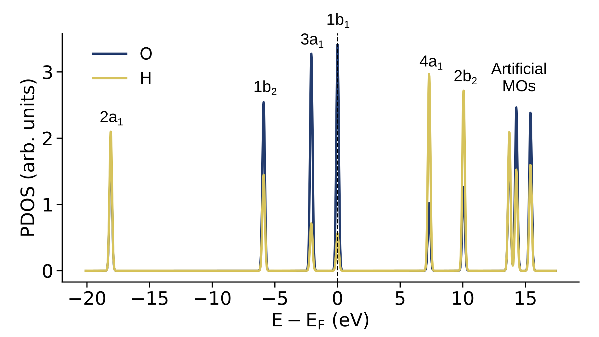
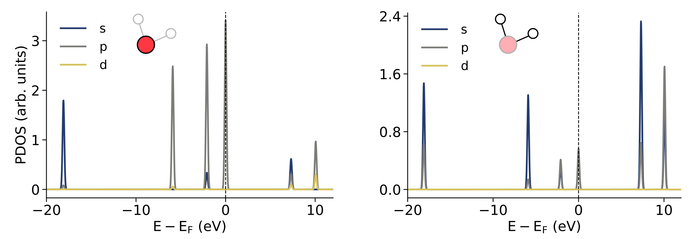
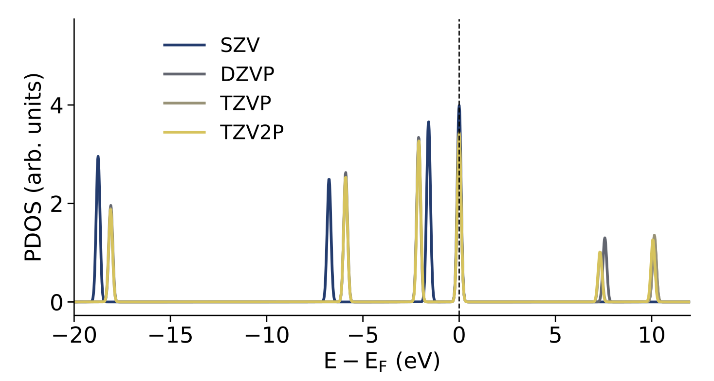
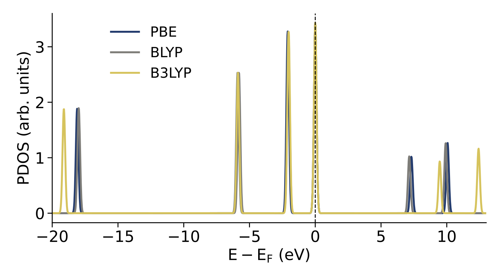

# Results - Single water molecule

This section presents the **projected density of states (PDOS)** for a **single water molecule in an empty (non-periodic) simulation box**, computed using CP2K. The computational parameters used for these calculations are those described in **README.md** and **input.inp**, and define the reference setup for the first set of results shown below.

In the following sections, several key parameters are systematically varied, namely `BASIS_SET`, `CUTOFF`, `EPS_SCF`, and `XC_FUNCTIONAL`, in order to assess their respective impact on the computed PDOS.

## PDOS of a single water molecule

Figure 1 shows the PDOS of an isolated H₂O molecule, decomposed into contributions from **oxygen (O)** and **hydrogen (H)** atoms. Energies are referenced to the Fermi level.

  

  Figure 1 — PDOS (projected per atom-type) of an isolated H₂O molecule.

The **occupied states** at negative energies correspond to the well-known molecular orbitals of water. The deep-lying **2a₁** state exhibits a mixed contribution from both oxygen and hydrogen atoms, reflecting its bonding character involving O–H interactions. The valence orbitals **1b₂** and **3a₁** are dominated by oxygen character with a smaller hydrogen contribution, consistent with O–H bonding and hybridization. The **highest occupied molecular orbital (HOMO)**, labeled **1b₁**, is almost entirely oxygen-centered, in agreement with its largely non-bonding O 2p character.

At positive energies, the **unoccupied molecular orbitals** (**4a₁**, **2b₂**) become visible. These states exhibit increased hydrogen character, reflecting their antibonding nature. At higher energies, additional peaks appear that correspond to **artificial (added) molecular orbitals**, which are included to stabilize the SCF procedure and to enable analysis of the unoccupied part of the PDOS.

  

  Figure 2 — PDOS (projected per orbital-type) of an isolated H₂O molecule for (left) O, and (right) H atoms.

Figure 2 shows the **orbital-resolved PDOS**, decomposed into **s**, **p**, and **d** contributions, separately for the **oxygen atom (left)** and the **hydrogen atoms (right)**.

For oxygen, the **deep valence state** around −18 eV is dominated by **s-character**, corresponding to the O 2s contribution to the **2a₁** molecular orbital. The valence region closer to the Fermi level is largely governed by **p-character**, reflecting the central role of O 2p orbitals in forming the bonding (**1b₂**, **3a₁**) and non-bonding (**1b₁**) molecular orbitals of water. Only negligible d-character is observed, arising from polarization functions in the basis set rather than true atomic d states.

For hydrogen, the PDOS is almost entirely of **s-character**, as expected from the H 1s atomic orbitals. Hydrogen contributions appear both in bonding states at negative energies and in antibonding states at positive energies, while p- and d-character remain minimal and originate solely from basis-set polarization functions.

This orbital-resolved analysis highlights the distinct roles of oxygen and hydrogen atomic orbitals in shaping the electronic structure of water, and provides a clear basis for interpreting how basis-set choice and projection schemes affect DOS and PDOS calculations in CP2K.

## Impact of the `BASIS_SET` parameter

  

  Figure 3 — PDOS (projected on the O atom) of an isolated H₂O molecule for a varying **BASIS_SET** CP2K parameter.

## Impact of the `CUTOFF` parameter

  

  Figure 4 — PDOS (projected on the O atom) of an isolated H₂O molecule for a varying **CUTOFF** CP2K parameter.

## Impact of the `EPS_SCF` parameter

  

  Figure 5 — PDOS (projected on the O atom) of an isolated H₂O molecule for a varying **EPS_SCF** CP2K parameter.

## Impact of the `XC_FUNCTIONAL` parameter

  

  Figure 6 — PDOS (projected on the O atom) of an isolated H₂O molecule for a varying **XC_FUNCTIONAL** CP2K parameter.

